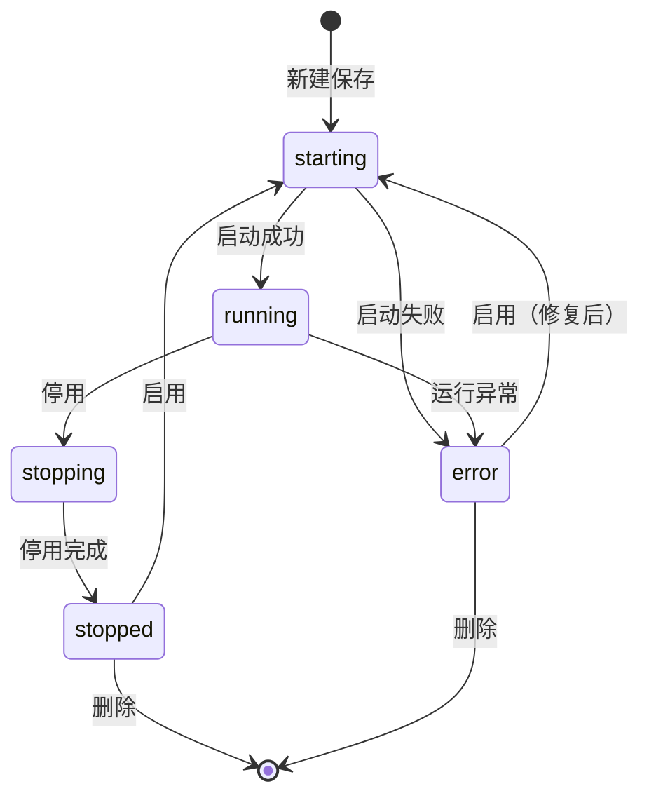

# 产品需求文档 (PRD)：xSpark 知识库平台 — 模型服务接入

**版本**：V1.1  
**日期**：2026-06-12  
**状态**：初版（基于 HTML 原型）  
**关联原型**：`xSpark/模型服务.html`  
**所属产品**：Lenovo xSpark 知识库平台  
**模块路径**：系统管理 → 模型服务

---

## 1. 文档概述

### 1.1 背景

xSpark 知识库平台在对话、知识问答、智能体编排等场景中依赖大语言模型及多模态能力。当前平台已具备知识库、运营分析等能力，但**项目内模型接入与生命周期管理**缺少统一入口，导致：

- 各业务模块重复配置模型 API，密钥分散、难以审计；
- 项目管理员无法在一处查看模型运行状态与可用能力类型；
- 知识问答、RAG 检索、重排序等链路无法稳定绑定项目级模型资源。

本模块在 **系统管理** 下新增 **模型服务**，支持通过 OpenAI 兼容等方式接入第三方或内部模型网关，并对模型进行启用、停用与配置维护。

模型按 **可见范围** 分为两类：

- **公共模型**：在 **默认项目** 中维护，平台全部用户、全部项目均可使用；
- **项目私有模型**：在用户 **自己的项目** 中配置，仅 **当前项目** 可使用。

### 1.2 产品目标

| 目标 | 说明 |
|------|------|
| **统一接入** | 默认项目维护公共模型；各项目可配置私有模型，供问答、Agent、工作流等复用 |
| **可视管理** | 卡片视图展示模型能力类型、运行状态与默认模型标识 |
| **安全可控** | API Key 加密存储，界面脱敏展示；支持连接测试后再保存 |
| **生命周期** | 支持启用 / 停用 / 删除，状态可追踪（启动中、运行、停止等） |

### 1.3 目标用户

| 角色 | 诉求 |
|------|------|
| **平台管理员** | 在默认项目中维护全部公共模型（接入、编辑、启停、删除） |
| **项目管理员** | 在本项目中维护项目私有模型；可查看并使用公共模型 |
| **项目成员** | 查看可用模型列表，在业务模块中选择「运行」中的模型 |
| **平台运维** | 查看模型异常状态，排查连接与可用性问题 |

### 1.4 范围说明

**本期包含（In Scope）**

- 模型服务列表（卡片视图）
- 筛选、搜索、分页
- 接入 / 编辑模型弹窗
- 连接测试
- 卡片更多操作：启用、停用、编辑、删除

**本期不包含（Out of Scope）**

- 列表视图（原型占位，后续迭代）
- 模型调用量统计、成本分析（属运营分析模块）
- 自动健康巡检调度策略配置（原型已移除「健康检测」字段）

---

## 2. 用户场景

### 2.1 在默认项目维护公共模型

平台管理员切换到 **默认项目**，进入 **系统管理 → 模型服务**，点击 **+ 添加服务** 接入模型。保存后该模型标记为 **公共模型**，平台内所有项目的用户在知识问答、Agent 配置等场景均可选用（状态为「运行」时）。

### 2.2 在自有项目配置私有模型

项目管理员在自己负责的项目中进入模型服务，添加仅服务于本项目的模型配置。保存后该模型仅在本项目可见、可选用，其他项目用户无法看到或使用。

### 2.3 业务侧选用模型

普通用户在当前项目下的对话、知识库问答、智能体配置等模块选择模型时，可选范围为：

```
可用模型 = 全部公共模型（running） ∪ 当前项目私有模型（running）
```

### 2.4 维护已有模型

管理员在卡片上点击 **⋯ → 编辑**，修改服务配置（KEY 留空表示不修改）。连接异常模型在修复配置后可 **启用**。

### 2.5 临时下线模型

对 **运行** 中模型执行 **停用**，状态经 **停止中** 变为 **停止**，下游业务不可再选用该模型，配置保留可再次启用。

- 公共模型停用：全平台用户均不可再选用  
- 项目私有模型停用：仅当前项目不可再选用  

### 2.6 检索与筛选

模型较多时，按 **模型类型**、**模型状态** 筛选，或按 **服务名称** 搜索，结合分页浏览。

---

## 3. 信息架构

### 3.1 入口

```
xSpark 平台
└── 左侧导航
    └── 系统管理
        ├── API Key
        ├── 系统配置
        ├── …
        └── 模型服务  ← 本模块
```

### 3.2 页面结构

```
模型服务页
├── 页头：标题「模型服务」
├── 筛选工具栏
│   ├── 模型类型筛选
│   ├── 模型状态筛选
│   ├── 服务名称搜索 + 搜索按钮
│   ├── + 添加服务
│   └── 视图切换（卡片视图 / 列表视图）
├── 模型卡片网格（默认 4 列）
└── 分页（总条数、页码、每页条数）
```

### 3.3 弹窗

- **接入模型** / **编辑模型**：表单弹窗，底部操作 **取消 | 测试连接 | 确定**

---

## 4. 数据模型

### 4.1 模型服务实体 `ModelService`

| 字段 | 类型 | 必填 | 说明 |
|------|------|------|------|
| `id` | string | 是 | 服务唯一标识 |
| `project_id` | string | 是 | 所属项目；公共模型归属 **默认项目** |
| `scope` | enum | 是 | 可见范围：`public`（公共）/ `project`（项目私有），见 §4.5 |
| `service_name` | string | 是 | 服务名称，列表展示用 |
| `api_format` | enum | 是 | API 格式：`OpenAI` / `Azure` / `Anthropic` / `Custom` |
| `model_url` | string | 是 | 模型 API Base URL |
| `api_key` | string | 是 | API Key，**加密存储**，界面仅显示 `sk-****` + 末 4 位 |
| `model_name` | string | 是 | 模型 ID / 名称，调用时传入 |
| `model_type` | enum | 是 | 见 §4.2 |
| `max_length` | integer | 是 | 最大上下文 Token 长度，默认 8192 |
| `description` | string | 否 | 服务描述，最长 200 字 |
| `model_status` | enum | 是 | 见 §4.3 |
| `is_default` | boolean | 否 | 是否为项目默认模型，卡片展示「默认模型」标签 |
| `created_at` | datetime | 是 | 创建时间 |
| `updated_at` | datetime | 是 | 最近更新时间 |

### 4.2 模型类型 `model_type`

| 值 | 展示名 | 典型用途 |
|----|--------|----------|
| `chat` | 文本生成 | 对话、知识问答、Agent 推理 |
| `audio` | 语音识别 | 语音转写、语音问答 |
| `image` | 图像理解 | 图文问答、多模态检索 |
| `rerank` | 重排序 | RAG 检索结果重排 |
| `embedding` | 向量嵌入 | 知识库向量化、语义检索 |

### 4.3 模型状态 `model_status`

| 状态 | 展示名 | 说明 | 卡片圆点 |
|------|--------|------|----------|
| `starting` | 启动中 | 新建或启用过程中 | 橙色闪烁 |
| `running` | 运行 | 可被选用于业务调用 | 绿色 |
| `stopping` | 停止中 | 停用过程中 | 橙色 |
| `stopped` | 停止 | 已停用，不可调用 | 灰色 |
| `error` | 异常 | 连接失败或运行异常 | 红色 |

### 4.4 状态流转



**操作与状态约束**

| 操作 | 允许的前置状态 | 目标状态 |
|------|----------------|----------|
| 新建保存 | — | `starting` → `running` / `error` |
| 启用 | `stopped`、`error` | `starting` → `running` |
| 停用 | `running` | `stopping` → `stopped` |
| 编辑 | 除 `starting`、`stopping` 外建议允许 | 保持原状态或触发重连 |
| 删除 | 非过渡态优先；`starting`/`stopping` 需提示等待 | 物理删除 |

### 4.5 模型可见范围 `scope`

| 值 | 名称 | 配置入口 | 维护权限 | 使用范围 |
|----|------|----------|----------|----------|
| `public` | 公共模型 | **默认项目** → 模型服务 | 平台管理员（默认项目管理员） | **全部项目、全部用户** 可选用 |
| `project` | 项目私有模型 | **用户自己的项目** → 模型服务 | 该项目管理员 | **仅当前项目** 可选用 |

**规则摘要**

1. 公共模型只能在 **默认项目** 中创建与维护，创建时自动标记 `scope = public`。  
2. 非默认项目创建的模型自动标记 `scope = project`，`project_id` 为当前项目。  
3. 非默认项目的模型服务页展示：**本项目私有模型** + **全部公共模型**（公共模型只读，不可编辑 / 删除，可查看状态）。  
4. 默认项目的模型服务页仅展示与管理 **公共模型**。  
5. 下游业务模块拉取模型列表时，按当前登录项目合并公共模型与项目私有模型。

```mermaid
flowchart LR
    subgraph default [默认项目]
        A[平台管理员维护]
        B[公共模型 scope=public]
    end
    subgraph userProj [用户项目 X]
        C[项目管理员维护]
        D[私有模型 scope=project]
    end
    subgraph usage [项目 X 可选用]
        E[全部公共模型]
        F[项目 X 私有模型]
    end
    A --> B
    C --> D
    B --> E
    D --> F
    E --> G[问答 / Agent / RAG]
    F --> G
```

---

## 5. 功能需求

### 5.1 功能列表

| 序号 | 功能点 | 说明 | 优先级 | 原型 |
|------|--------|------|--------|------|
| F-001 | 模块入口 | 系统管理下「模型服务」菜单，高亮当前页 | P0 | 已实现 |
| F-002 | 卡片视图列表 | 4 列网格展示模型卡片 | P0 | 已实现 |
| F-003 | 模型类型筛选 | 全部 / 文本生成 / 语音识别 / 图像理解 / 重排序 / 向量嵌入 | P0 | 已实现 |
| F-004 | 模型状态筛选 | 全部 / 启动中 / 运行 / 停止中 / 停止 / 异常 | P0 | 已实现 |
| F-005 | 服务名称搜索 | 按服务名称、模型名称模糊匹配，支持回车与搜索按钮 | P0 | 已实现 |
| F-006 | 添加服务 | 打开接入模型弹窗 | P0 | 已实现 |
| F-007 | 接入 / 编辑表单 | 见 §6 字段定义 | P0 | 已实现 |
| F-008 | 测试连接 | 弹窗底部按钮，校验 URL + KEY 连通性 | P0 | 已实现 |
| F-009 | 更多操作菜单 | 启用 / 停用 / 编辑 / 删除 | P0 | 已实现 |
| F-010 | 启用模型 | 停用或异常 → 启动中 → 运行 | P0 | 已实现 |
| F-011 | 停用模型 | 运行 → 停止中 → 停止 | P0 | 已实现 |
| F-012 | 删除模型 | 二次确认后删除 | P0 | 已实现 |
| F-013 | 分页 | 共 N 条、页码、12/24/48 条每页 | P1 | 已实现 |
| F-014 | 默认模型标识 | 卡片展示「默认模型」标签 | P1 | 已实现 |
| F-015 | 列表视图 | 表格形式展示，与卡片视图切换 | P2 | 占位 |
| F-016 | 设置默认模型 | 更多操作中指定项目默认模型 | P2 | 未实现 |
| F-017 | 调用审计 | 记录接入、启停、删除操作日志 | P1 | 未实现 |
| F-018 | 公共 / 私有范围 | 默认项目维护公共模型；自有项目维护私有模型 | P0 | 未实现 |
| F-019 | 跨项目可见性 | 非默认项目列表合并展示公共模型（只读）+ 本项目私有模型 | P0 | 未实现 |
| F-020 | 模型范围标签 | 卡片区分「公共模型」/「项目私有」标识 | P1 | 未实现 |

### 5.2 卡片展示规范

每张模型卡片包含：

| 区域 | 内容 |
|------|------|
| 头部 | 模型图标 + **模型名称**（`model_name`） |
| 标签区 | 模型类型标签（如「Tt 文本生成」）；「公共模型」或「项目私有」范围标签；可选「默认模型」 |
| 底部左侧 | **启用状态** + 状态圆点 + 状态文案 |
| 底部右侧 | **⋯** 更多操作 |

**交互**

- 单击卡片：选中高亮（蓝框）
- 双击卡片：打开编辑弹窗
- 点击 ⋯：展开操作菜单；点击页面其他区域关闭菜单

### 5.3 更多操作菜单

| 菜单项 | 可用条件 | 行为 |
|--------|----------|------|
| 启用 | `stopped` 或 `error` | 触发启用流程，过渡态菜单项置灰 |
| 停用 | `running` | 触发停用流程 |
| 编辑 | 有维护权限且非过渡态 | 打开编辑弹窗；**公共模型在非默认项目中不可编辑** |
| 删除 | 有维护权限且非过渡态 | 确认框 → 删除；**公共模型在非默认项目中不可删除** |

---

## 6. 接入 / 编辑表单（F-007）

### 6.1 字段定义

| 字段 | 必填 | 控件 | 校验 / 说明 |
|------|------|------|-------------|
| 服务名称 | 是 | 文本 | 非空，项目内建议唯一 |
| API 格式 | 是 | 下拉 | OpenAI（默认）/ Azure OpenAI / Anthropic / 自定义 |
| 模型 URL | 是 | 文本 | 合法 URL，OpenAI 兼容 `/v1` 端点 |
| KEY | 是* | 密码 | 新建必填；编辑留空表示不修改 |
| 模型名称 | 是 | 文本 | 与上游模型 ID 一致，如 `Qwen3-32B` |
| 模型类型 | 是 | 下拉 | 文本生成 / 语音识别 / 图像理解 / 重排序 / 向量嵌入 |
| Max length | 是 | 数字 | 正整数，默认 8192；Tooltip 说明为最大上下文 Token |
| 服务描述 | 否 | 多行文本 | 最长 200 字，实时字数统计 `0 / 200` |

### 6.2 底部按钮

| 按钮 | 行为 |
|------|------|
| 取消 | 关闭弹窗，不保存 |
| 测试连接 | 使用当前表单中的模型 URL + KEY 探测连通性，成功 / 失败 Toast 提示 |
| 确定 | 校验通过后保存；新建默认进入 `starting` 状态 |

### 6.3 校验规则

1. 服务名称、模型 URL、模型名称、模型类型、Max length 不可为空  
2. 新建时 KEY 不可为空  
3. Max length ≥ 1  
4. 服务描述 ≤ 200 字符  
5. 测试连接失败时允许仍保存（可配置为强制测试通过才允许保存，建议 P1 策略项）

---

## 7. 权限与安全

### 7.1 模型范围与维护权限

| 模型类型 | 配置位置 | 谁可维护（增删改、启停） | 谁可使用 |
|----------|----------|--------------------------|----------|
| **公共模型** | 默认项目 · 模型服务 | 平台管理员 / 默认项目管理员 | **全部项目、全部用户** |
| **项目私有模型** | 用户自己的项目 · 模型服务 | 该 **项目管理员** | **仅当前项目** 内用户 |

**补充说明**

- 项目成员可在业务模块中 **选用** 公共模型及本项目私有模型，但 **不能** 维护模型配置。  
- 在 **非默认项目** 打开模型服务页时，公共模型以 **只读** 方式展示（可查看状态，不可编辑 / 删除 / 启停）。  
- 在 **默认项目** 中不提供「项目私有模型」创建入口，仅维护公共模型。

### 7.2 角色权限矩阵

| 操作 | 默认项目管理员 | 其他项目管理员 | 项目成员 |
|------|----------------|----------------|----------|
| 查看公共模型 | ✓ | ✓（只读） | ✓（只读） |
| 维护公共模型（增删改、启停） | ✓ | — | — |
| 查看本项目私有模型 | — | ✓ | ✓（只读） |
| 维护本项目私有模型 | — | ✓ | — |
| 业务模块选用模型 | ✓ | ✓ | ✓ |

### 7.3 安全要求

- API Key **加密存储**（AES / KMS），数据库与日志中不可出现明文  
- 界面仅展示掩码：`sk-****` + 末 4 位  
- 编辑时 KEY 留空表示不轮换密钥  
- 模型 URL 需校验 HTTPS（内网环境可配置白名单例外）  
- 删除服务前校验是否被知识库、Agent 引用，若已引用需二次提示或阻断（P1）

---

## 8. 接口需求（概要）

> 具体 Path 与字段以实现阶段 API 设计为准。

| 方法 | 路径（示例） | 说明 |
|------|--------------|------|
| GET | `/api/v1/projects/{id}/model-services` | 列表：默认项目仅返回 `scope=public`；其他项目返回 `scope=project`（本项目）+ `scope=public`（只读） |
| GET | `/api/v1/projects/{id}/model-services/available` | 业务选用：公共模型 ∪ 当前项目私有模型，仅 `running` |
| POST | `/api/v1/projects/{id}/model-services` | 创建：默认项目 → `scope=public`；其他项目 → `scope=project` |
| PUT | `/api/v1/projects/{id}/model-services/{sid}` | 更新配置 |
| DELETE | `/api/v1/projects/{id}/model-services/{sid}` | 删除 |
| POST | `/api/v1/projects/{id}/model-services/test-connection` | 测试连接（URL + Key + Format） |
| POST | `/api/v1/projects/{id}/model-services/{sid}/enable` | 启用 |
| POST | `/api/v1/projects/{id}/model-services/{sid}/disable` | 停用 |

**测试连接请求体示例**

```json
{
  "api_format": "OpenAI",
  "model_url": "https://api.deepseek.com/v1",
  "api_key": "sk-***",
  "model_name": "deepseek-chat"
}
```

**列表项响应示例**

```json
{
  "id": "ms-001",
  "service_name": "Qwen3-32B 服务",
  "model_name": "Qwen3-32B",
  "model_type": "chat",
  "scope": "public",
  "model_status": "running",
  "is_default": true,
  "max_length": 32768,
  "updated_at": "2026-06-10T14:32:00Z"
}
```

---

## 9. 与平台其他模块关系

| 模块 | 关系 |
|------|------|
| **知识库 / 问答** | 选用 `running` 模型：公共 `chat` 模型 + 当前项目私有 `chat` 模型 |
| **RAG 检索** | 公共或项目私有 `embedding` 向量化；`rerank` 重排序同理 |
| **智能体** | Agent 配置页下拉：**全部公共模型** + **当前项目私有模型**（均为 `running`） |
| **默认项目** | 平台公共模型池的唯一维护入口，不对普通项目暴露写权限 |
| **运营分析 · 调用统计** | 读取模型调用数据，不在本模块展示 |
| **凭证管理 / API Key** | 平台访问凭证与本模块模型供应商 KEY 职责分离，不互相替代 |

---

## 10. 非功能需求

| 类别 | 要求 |
|------|------|
| 性能 | 列表首屏 ≤ 2s（50 条以内）；测试连接超时 10s，可配置 |
| 可用性 | 单项目支持 ≥ 100 个模型服务配置 |
| 兼容性 | 优先支持 OpenAI Chat Completions 兼容协议 |
| 国际化 | 界面中文为主，字段 `Max length` 可保留英文 |
| 审计 | 接入、编辑、启停、删除写操作日志，含操作人、时间、服务 ID |

---

## 11. 验收标准

### 11.1 列表与筛选

- [ ] 系统管理下可进入模型服务页，默认卡片视图  
- [ ] 可按 5 种模型类型、5 种状态筛选，组合筛选结果正确  
- [ ] 服务名称搜索支持模糊匹配，分页与总条数展示正确  

### 11.2 接入与编辑

- [ ] 添加服务弹窗包含 §6.1 全部字段，必填校验生效  
- [ ] 测试连接可区分成功 / 失败并提示  
- [ ] 新建后卡片出现且状态为启动中，成功后为运行  
- [ ] 编辑时 KEY 留空不修改原密钥，修改其他字段保存成功  

### 11.3 生命周期

- [ ] 运行中模型可停用，经停止中变为停止  
- [ ] 停止 / 异常模型可启用，经启动中变为运行  
- [ ] 启动中 / 停止中时启用、停用菜单项置灰  
- [ ] 删除需确认，删除后列表不再展示  

### 11.4 模型范围与权限

- [ ] 默认项目中创建的模型为公共模型，全平台项目均可选用  
- [ ] 非默认项目创建的模型为项目私有，仅该项目可选用  
- [ ] 非默认项目列表展示公共模型（只读）+ 本项目私有模型（可维护）  
- [ ] 非默认项目用户对公共模型不可编辑、删除、启停  
- [ ] 业务模块模型下拉仅包含：全部公共模型 + 当前项目私有模型  

### 11.5 安全

- [ ] 界面不出现完整 API Key  
- [ ] 接口与存储侧 Key 加密，日志脱敏  

---

## 12. 迭代规划建议

| 阶段 | 内容 |
|------|------|
| **MVP（本期）** | 卡片视图、接入 / 编辑 / 测试连接、启停删、筛选分页 |
| **V1.1** | 列表视图、设置默认模型、删除引用校验、操作审计 |
| **V1.2** | 批量导入、模型分组、与运营分析调用量联动 |

---

## 13. 版本历史

| 版本 | 日期 | 修改人 | 说明 |
|------|------|--------|------|
| V1.1 | 2026-06-12 | — | 补充公共模型（默认项目）与项目私有模型的权限与可见范围说明 |
| V1.0 | 2026-06-12 | — | 基于 `xSpark/模型服务.html` 原型输出初版 PRD |
