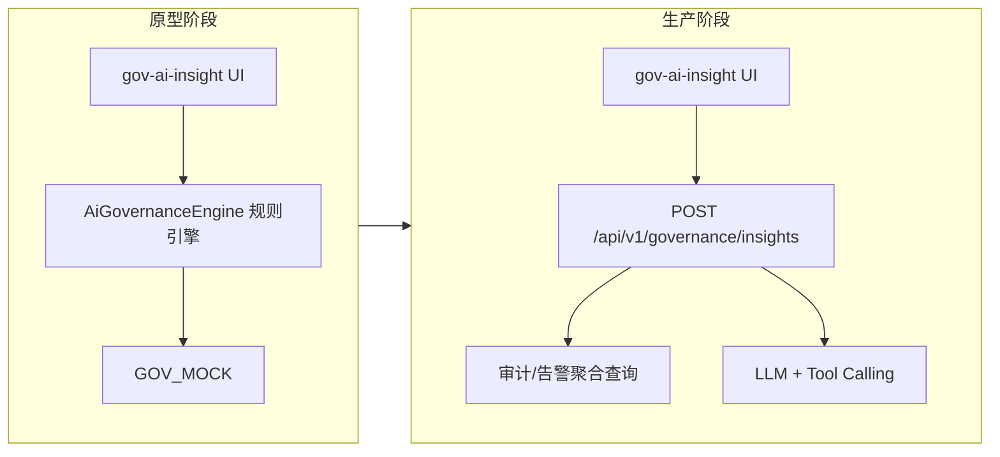

# 产品需求文档 (PRD)：AI 治理 — AI 智能功能

> **文档编号**：PRD-2026-AIGOV-AI  
> **版本**：V1.0  
> **日期**：2026-06-11  
> **状态**：初版（基于 HTML 原型）  
> **关联原型**：[`原型/治理/ai治理/index.html`](../../../原型/治理/ai治理/index.html)  
> **父文档**：[`2026-06-10-初版PRD.md`](./2026-06-10-初版PRD.md)（AI 治理模块整体）  
> **实现参考**：[`ai-governance-insight.js`](../../../原型/治理/ai治理/ai-governance-insight.js)、[`governance.js`](../../../原型/治理/ai治理/governance.js)

---

## 1. 文档概述

### 1.1 背景

AI 治理模块已提供用户操作审计、工具执行记录与风险告警列表。管理者面对海量日志时，难以快速定位风险根因并制定治理策略。**AI 智能治理**在概览页提供「读数据 + 给建议」能力：自动汇总权限范围内的风险与使用态势，并支持中文自然语言追问，降低审计与合规决策成本。

与 **AI 观测** 中的「AI 智能观测」（F-106，解读 Trace/成本/延迟）对称，本功能侧重 **合规、权限、使用规范** 三类治理维度。

### 1.2 产品目标

| 目标 | 说明 |
|------|------|
| **态势感知** | 进入概览即可看到权限范围、风险摘要、使用概况与 Top 建议 |
| **按需深挖** | 管理者用自然语言提问，获得结构化分析与可执行建议 |
| **可解释** | 输出带建议类型标签；结论须引用可审计的数据来源（审计 ID、告警 ID 等） |
| **权限一致** | 分析范围严格等于当前用户可见 Workspace，与列表筛选联动 |

### 1.3 目标用户

| 角色 | 典型诉求 |
|------|----------|
| Workspace / 平台管理员 | 「本周有哪些高风险？」「谁导出数据最多？」 |
| 安全合规人员 | 「export 行为是否合规？」「权限变更是否需要复核？」 |
| 运维负责人 | 「MCP 为什么连续失败？」「是否需要配置调用限额？」 |

### 1.4 范围边界

**本期（原型 / MVP）包含**

- 概览 Tab 顶部「AI 智能治理」面板：默认洞察、追问、清除
- Workspace 筛选与 AI 分析上下文联动
- 建议类型标签（安全合规、权限治理、使用规范、成本优化）
- 「生成周报」「订阅告警」按钮占位（P2）

**本期不包含**

- 用户操作 / 工具执行 Tab 内的独立 AI 面板（后续可扩展，对齐 AI 观测 Tracing AI 面板）
- 自然语言 → Filters 自动转换（AI 观测 F-404 能力，治理侧 P2）
- 一键执行治理动作（如直接创建审批规则、限流策略）— 仅输出建议文案
- 真实 LLM 调用（原型为规则引擎 mock；生产见 §6）

---

## 2. 用户场景

### 场景 1：每日巡检

管理员打开 AI 治理 → 概览，无需输入即可阅读默认洞察：可见 Workspace 数、本周高风险事件、工具调用趋势摘要及 3 条治理建议。

### 场景 2：导出合规调查

安全人员输入「最近有哪些数据导出？风险如何？」，系统返回 export 类审计记录列表、风险等级及「启用二次审批」类建议。

### 场景 3：MCP 故障治理

运维输入「MCP 失败原因？」，系统聚合 prod-mcp-git 等失败/超时记录，建议健康检查、熔断与 QPS 限额。

### 场景 4：异常用户识别

管理员输入「谁使用最频繁？有没有风险用户？」，系统返回 Top 活跃用户排行及 user_2847 等高风险用户说明。

---

## 3. 功能需求总览

| 序号 | 功能点 | 说明 | 优先级 | 原型状态 |
|------|--------|------|--------|----------|
| G-101 | AI 智能治理面板 | 概览 Tab 顶部常驻卡片：标题、说明、输入框、操作按钮 | P0 | 已实现 |
| G-102 | 默认洞察（零输入） | 点击「智能分析」且输入为空时，输出权限范围 + 风险摘要 + 使用概况 + 编号建议 | P0 | mock |
| G-103 | 自然语言追问 | 中文问题 → 结构化标题 + 正文 + 建议标签 | P1 | mock |
| G-104 | 建议类型标签 | 每条结果展示 1～3 个标签，见 §4.3 | P1 | 已实现 |
| G-105 | Workspace 上下文联动 | 概览 Workspace 下拉变更后，AI 结果中的范围文案同步更新 | P1 | 已实现 |
| G-106 | 清除 | 清空输入框与结果区 | P0 | 已实现 |
| G-107 | 生成周报 | 一键生成治理周报（PDF/邮件） | P2 | 占位 |
| G-108 | 订阅告警 | 订阅高风险事件通知渠道 | P2 | 占位 |

---

## 4. 功能详细说明

### 4.1 G-101 AI 智能治理面板

#### 布局与文案

| 元素 | 规则 |
|------|------|
| 位置 | **概览 Tab 内容区最顶部**（KPI 卡片之上） |
| 标题 | 「AI 智能治理」 |
| 说明 | 明示基于「有权限的全部 Workspace」数据；不暗示已读取未授权数据 |
| 输入框 | 多行 textarea，placeholder 示例：「有哪些高风险事件？谁导出数据最多？MCP 失败怎么办？」 |
| 主按钮 | 「智能分析」— 触发分析 |
| 次按钮 | 「清除」— 清空输入与结果 |
| 扩展按钮 | 面板右上角「生成周报」「订阅告警」（P2 占位，点击 alert 演示） |

#### 视觉

- 与 AI 观测 Dashboard「AI 智能观测」卡片风格一致：浅蓝渐变底、Sparkle 图标、结果区浅蓝边框
- 结果区：标题行 + 标签行 + Markdown 正文

#### 验收

- [ ] 仅概览 Tab 展示该面板；切换至用户操作 / 工具执行 Tab 时不展示
- [ ] 面板在 1280px 宽度下不换行错乱；扩展按钮在小屏可折行

---

### 4.2 G-102 默认洞察（零输入分析）

触发条件：用户点击「智能分析」且输入框为空（或仅空白字符）。

#### 输出结构（固定四段）

| 段落 | 内容 | 数据来源 |
|------|------|----------|
| 权限范围 | 当前用户姓名、可见 Workspace 数量与名称列表、当前视图（All / 单 Workspace） | 用户权限 + 工具栏 Workspace |
| 本周风险摘要 | 高风险事件数量；列举 high 级告警标题 | `riskAlerts`、`stats.highRisk` |
| 使用概况 | 7 日用户操作量、工具调用量及环比趋势 | `stats`、审计/执行聚合 API |
| 治理建议 | 编号列表 3 条，每条可执行、可关联实体名 | 规则引擎 / LLM + 告警与审计聚合 |

#### 原型示例（与 mock 对齐）

1. 为 **prod-mcp-git** 配置调用限额与超时熔断  
2. 对 **export** 类操作启用审批流  
3. 关注 **user_2847** 夜间高频调用，设置时段策略或告警阈值  

#### 默认标签

`安全合规`、`权限治理`、`使用规范`

#### 验收

- [ ] 零输入点击「智能分析」≤ 2s 内展示结果（生产）；原型即时返回
- [ ] 四条段落均存在；建议至少 3 条
- [ ] Workspace 切换后再次分析，「当前视图」文案更新

---

### 4.3 G-103 自然语言追问

#### 交互

1. 用户在输入框输入中文问题  
2. 点击「智能分析」  
3. 展示 `{ title, tags[], content }` 结构结果；**不覆盖**输入框内容（便于连续追问）

#### 意图分类（MVP 规则 / 生产 LLM Tool Calling）

| 意图 ID | 触发关键词（示例） | 分析标题 | 默认标签 | 数据检索范围 |
|---------|-------------------|----------|----------|--------------|
| `risk` | 风险、告警、异常、危险 | 风险分析 | 安全合规 | riskAlerts 全量 |
| `export` | 导出、export、泄露、数据 | 导出行为分析 | 安全合规、使用规范 | auditLogs.action=export |
| `tool_exec` | MCP、工具、Skill、Agent、智能体 | 工具与 MCP 执行分析 | 使用规范、成本优化 | toolExecutions |
| `user_behavior` | 用户、user、谁、活跃 | 用户行为分析 | 权限治理、使用规范 | topUsers + 审计按 user 聚合 |
| `compliance` | 合规、审批、权限、policy | 合规与权限建议 | 安全合规、权限治理 | permission.change、api_key.create 等 |
| `quota` | 配额、限额、成本、频率 | 配额与使用频率 | 成本优化、使用规范 | stats、夜间调用基线 |
| `fallback` | 未匹配 | 智能分析 | 使用规范 | stats 摘要 + 引导示例问题 |

#### 输出格式

```typescript
interface GovernanceInsightResult {
  title: string;           // 如「导出行为分析」
  tags: string[];          // 见 §4.3.1
  content: string;         // Markdown 正文，支持 **加粗**、列表、编号
  citations?: {            // 生产必选，原型可选
    type: 'audit' | 'alert' | 'tool_exec';
    id: string;
  }[];
}
```

#### §4.3.1 建议类型标签枚举

| 标签 | 含义 | 典型建议 |
|------|------|----------|
| 安全合规 | 数据安全、导出、敏感操作 | 启用审批、导出原因必填 |
| 权限治理 | 角色变更、API Key | 复核 scope、MCP 注册扫描 |
| 使用规范 | 异常时段、高频调用 | 培训、时段策略、告警阈值 |
| 成本优化 | 调用量、资源分布 | QPS 限额、批处理合并 |

每条结果展示 **1～3** 个标签，须与正文建议语义一致。

#### Fallback 行为

未识别意图时：

- 复述用户问题（引号包裹）
- 给出当前 scope 下高风险数、工具调用量摘要
- 提示 3～4 个可尝试的示例问题

#### 验收

- [ ] 上表 6 类意图各至少 1 个测试问句可命中（见 §8）
- [ ] 结果区展示 title、tags、content；`**text**` 渲染为加粗
- [ ] 追问后输入框内容保留

---

### 4.4 G-104～G-106 辅助能力

#### G-104 建议类型标签

- 展示在结果标题右侧或下方，pill 样式
- 颜色与治理主题色一致，区别于风险等级 badge

#### G-105 Workspace 上下文联动

| 状态 | AI 分析 scope 文案 |
|------|-------------------|
| All Workspaces | 「全部可见 Workspace」 |
| 单 Workspace | 「Workspace「{name}」」 |

规则：

- 变更概览 Workspace 下拉后，若已有分析结果，**不自动重算**（避免惊扰）；用户再次点击「智能分析」时使用新 scope
- 生产环境：后端 API 须接收 `workspace_id` 可选参数，空表示 all

#### G-106 清除

- 清空 `#govOverviewAiInput` 与结果区
- 不重置 Workspace 下拉

---

### 4.5 G-107 / G-108 扩展能力（P2）

#### G-107 生成周报

- 触发：面板右上角按钮
- 输出：PDF 或邮件，包含 KPI、风险告警、Top 用户、本周建议摘要
- 依赖：定时任务 + 模板引擎；MVP 仅 UI 占位

#### G-108 订阅告警

- 触发：面板右上角按钮
- 能力：订阅 high 级风险告警 → 邮件 / IM / Webhook
- 配置项：渠道、频率（实时 / 日报）、Workspace 范围

---

## 5. 数据与上下文

### 5.1 分析上下文（AiGovernanceEngine.getContext）

| 字段 | 来源 | 用途 |
|------|------|------|
| `user` | 当前登录用户 | 权限范围文案 |
| `workspaces[]` | 用户可见 Workspace 列表 | 范围枚举 |
| `workspaceFilter` | 概览工具栏 | 当前分析 scope |
| `timeRange` | 1d / 7d（概览） | 聚合窗口 |

### 5.2 输入数据集

| 数据集 | 用途 | 关键字段 |
|--------|------|----------|
| `stats` | KPI、趋势摘要 | todayOps, highRisk, toolCalls, *Trend |
| `riskAlerts` | 风险意图 | level, title, desc, workspace, time |
| `auditLogs` | 导出、权限、用户行为 | action, user, resource, risk, detail |
| `toolExecutions` | MCP/工具失败分析 | type, resource, status, error |
| `topUsers` | 活跃用户排行 | id, ops, risk, workspace |
| `resourceDist` | 配额/成本类建议 | type, count, pct |

### 5.3 权限规则

- 仅聚合当前用户 **有读权限** 的 Workspace 数据
- 不得在回复中泄露无权限 Workspace 名称或记录 ID
- 生产：API 层强制 `workspace_id IN (:allowed_ids)`

---

## 6. 技术方案演进



### 6.1 原型实现（当前）

- 前端 `AiGovernanceEngine.analyze(query, workspaceFilter)` 正则匹配意图
- 数据来自 `GOV_MOCK` 静态对象
- Markdown 由 `formatMarkdown()` 轻量转 HTML

### 6.2 生产实现（规划）

**API**

```
POST /api/v1/governance/insights
Body: {
  "query": "有哪些高风险？",
  "workspace_id": null | "ws_xxx",
  "time_range": "7d"
}
Response: GovernanceInsightResult
```

**LLM 要求**

- System Prompt 限定：仅基于检索到的结构化数据回答，不得编造审计记录
- Tool：`search_audit_logs`, `search_tool_executions`, `list_risk_alerts`, `aggregate_stats`
- 每条建议尽量附带 `citations`
- 超时 15s；失败时降级为规则引擎或「暂无法分析」提示

---

## 7. 非功能需求

| 编号 | 类型 | 需求 | 衡量标准 |
|------|------|------|----------|
| NFR-AI-01 | 性能 | 洞察 API P95 响应 | < 5s（含 LLM）；规则降级 < 500ms |
| NFR-AI-02 | 安全 | 回复不包含无权限数据 | 权限测试 100% 通过 |
| NFR-AI-03 | 可解释 | 生产回复含 citations 或数据计数 | 抽检 ≥ 90% |
| NFR-AI-04 | 可用性 | 输入框支持中文 IME | 无截断、无重复提交 |
| NFR-AI-05 | 审计 | 记录每次 AI 问询（user、query、scope） | 日志保留 ≥ 90 天 |

---

## 8. 验收标准（测试用例摘要）

| ID | 步骤 | 期望 |
|----|------|------|
| TC-G-01 | 概览 Tab，输入为空，点击「智能分析」 | 展示「智能治理概览」+ 四段内容 + 3 个标签 |
| TC-G-02 | 输入「有哪些风险告警？」 | 标题「风险分析」；列出 mock 5 条告警 |
| TC-G-03 | 输入「谁导出数据最多？」 | 标题「导出行为分析」；≥ 2 条 export 记录 |
| TC-G-04 | 输入「MCP 失败怎么办？」 | 标题含 MCP；提及 prod-mcp-git 失败 |
| TC-G-05 | 切换 Workspace 为「IT 运维 Workspace」后再次零输入分析 | 正文含「Workspace「IT 运维 Workspace」」 |
| TC-G-06 | 点击「清除」 | 输入框与结果区为空 |
| TC-G-07 | 切换到「用户操作」Tab | 不展示 AI 智能治理面板 |
| TC-G-08 | 输入乱码「asdfqwerty」 | Fallback 回复 + 示例问题引导 |

---

## 9. 与 AI 观测 AI 功能对比

| 维度 | AI 观测 F-106 | AI 治理 G-102～G-103 |
|------|---------------|----------------------|
| 位置 | Dashboard + Tracing 面板 | 概览 Tab 顶部 |
| 数据 | Trace、Cost、Latency | Audit、ToolExec、Risk |
| 典型问题 | 成本为何上升？哪个模型最慢？ | 谁导出了数据？MCP 为何失败？ |
| 建议类型 | 性能、成本 | 合规、权限、使用规范 |
| 原型引擎 | AiObservabilityEngine | AiGovernanceEngine |

---

## 10. 版本历史

| 版本 | 日期 | 修改人 | 说明 |
|------|------|--------|------|
| V1.0 | 2026-06-11 | 产品经理 | 基于 AI 治理 HTML 原型初版；定义 G-101～G-108、意图表与 API 演进 |
